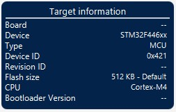
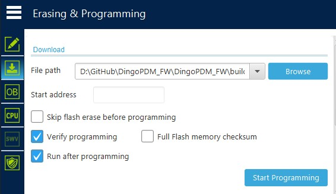

dingoPDM firmware can be updated using the onboard USB-C connection. 

## STM32CubeProgrammer

To update the firmware, the STMicroelectronics STM32CubeProgrammer is used. 

This software can be downloaded here: [STM32CubeProgrammer](https://www.st.com/en/development-tools/stm32cubeprog.html)

## Boot Switch

To update the firmware, the device must be put into bootloader using the `boot` switch on the PCB. 

!!! Note
    The case must be removed to access the boot switch.

    * Remove the DT connector and any wires going to the power/ground connections
    * Remove the 2x Philips screws next to the DT connector
    * Remove the 4x M6 screws around the perimeter of the device
    * Slide/wiggle the case up and off the device

To enter the bootloader, move the slide switch to the position that aligns it with the lines on the switch body

{ width="100", .off-glb }
{ width="100", .off-glb }

!!! Warning
    After updating, remember to set the boot switch back to the original position

## Connection

Connect a USB-C to USB-A cable to the PC. 

!!! Note
    V7.2 PCBs do not support USB-C to USB-C cables, a USB-C to USB-A cable must be used

!!! Note
    12V power is not required to perform the firmware update, the device will be powered by the USB cable

To verify that the device has entered the bootloader:

* Open the Windows `Device Manager`
* Expand `Universal Serial Bus devices`
* The `STM32 BOOTLOADER` should be listed
* { width="300" }

## Applying Update

* Install `STM32CubeProgrammer`
* Open `STM32CubeProgrammer`
* Change connection type to `USB`
* Press the refresh button to update the port

* { width="300" }

* Press the `Connect` button, after successful connection the `Target Information` should be updated
* { width="300" }
* Select the second icon on the left, `Erasing & Programming`
* { width="500" }
* Press `Browse` and select the new firmware .hex file
* Verify `Skip flash erase before programming` is unchecked
* Verify `Verify programming` and `Run after programming` are checked
* Press `Start Programming`
* After successful programming, the device will disconnect
* You should also receive pop-ups verifying successful programming
* { width="800" }

## Success

Congrats! You successfuly updated the dingoPDM firmware. 

The firmware version can be verified using DingoConfigurator

!!! Warning
    Don't forget to set the boot switch back to the original position!

!!! Danger
    A POWER CYCLE IS REQUIRED any time the boot switch is changed
