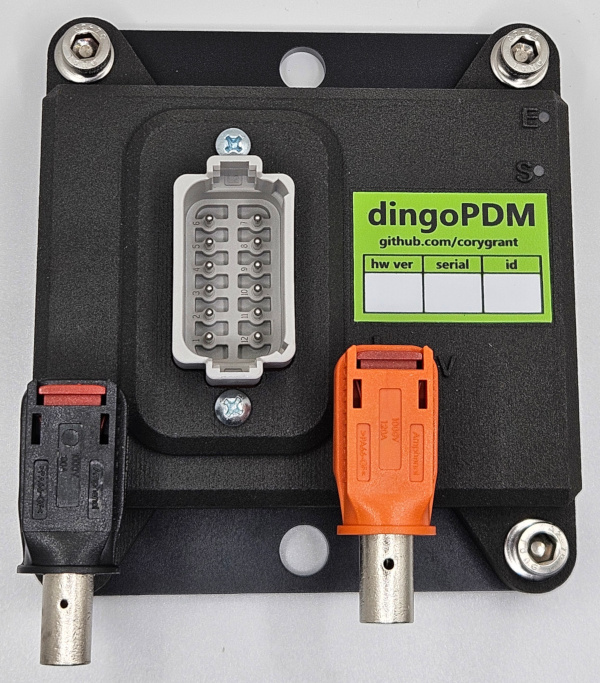
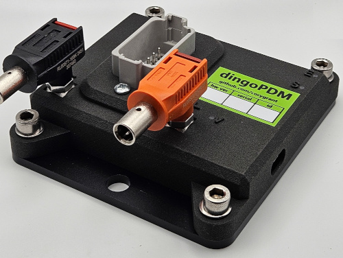
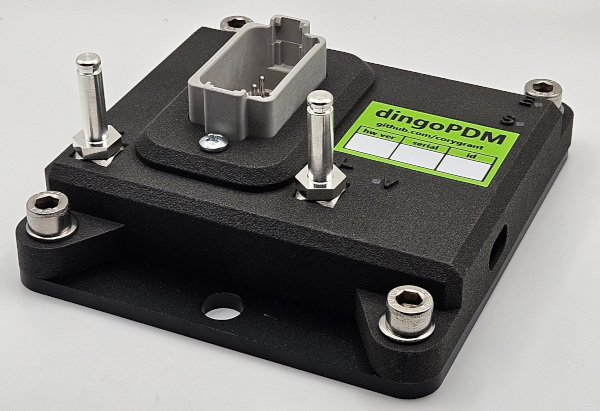

# Case

{ .off-glb }
{ .off-glb }

{ .off-glb }
{ .off-glb }

The mechanical design is centered around simple designs that can be created in a home shop. 

* 3D Printed Case
* Flat aluminum heatsink plate
* Flat aluminum baseplate
* The heatsink is designed to be 2 pieces. A heatsink plate and a baseplate
    * The heatsink plate provides clearance for the THT pins of the Deutsch connectors and the RedCube terminal while getting as close to the Profets as possible
    * !!! warning
        The heatsink plate should be covered on both sides with a thermal pad material to electricaly isolate the heatsink while still providing a thermal interface (Example: 3M 5583S)
    * The baseplate holds the case and also sandwiches the spacer plate to the PCB

## Exploded Assembly

| ID   | Description      | Details                      | Qty |
| ---- | ---------------- | ---------------------------- | --- |
| 1    | Baseplate        | `Aluminum 6061`              | 1   |
| 2    | Heatsink         | `Aluminum 6061`              | 1   |
| 3    | Case             | `3D Print`                   | 1   |
| 4.1  | PCB              |                              | 1   |
| 5.1  | Ring Lug         | `M6` or `1/4"`               | 1   |
| 5.2  | Lug Washers      | `M6 Flat`                    | 2   |
| 5.3  | Lug Screws       | `M6x1.0x14mm`                | 2   |
| 5.5  | Case Washers     | `M6 Flat`                    | 4   |
| 5.6  | Case Screws      | `M6x1.0x14mm`                | 4   |
| 5.7  | PCB Washers      | `M3 Flat`                    | 4   |
| 5.8  | PCB Screws       | `M3x0.5x12mm`                | 4   |
| 6    | DT Connector     | `12 Pin`                     | 1   |
| 10.1 | Light Pipe       | `PLPC2-10MM`                 | 3   |
| 13   | Connector Screws | `No. 6, 5/8" Thread Forming` | 2   |

## Radlok

As an alternative, Amphenol Radlok 5.7mm connectors can be used for the battery connections instead of ring connectors. 

- Radlok 5.7mm pins and 4AWG connectors are rated at 120A
- Radlock 5.7mm 6AWG connectors are rated at 90A

???+ Note 

    Radlok M6 pin threads are slightly too long, use a washer under the pin to space the pin out. 
    

| Description                  | Detail            | Rating | Qty | Part Number     |
| ---------------------------- | ----------------- | ------ | --- | --------------- |
| Pin                          | `M6x1.0`          | 120A   | 2   | `RL9057-101`    |
| M6 Washer                    | `M6 Flat`         |        | 2   |                 |
|                              |                   |        |     |                 |
| Red Connector                | `6AWG` / `16mm^2` | 90A    | 1   | `RL0057-1-16RE` |
| Black Connector              | `6AWG` / `16mm^2` | 90A    | 1   | `RL0057-1-16BK` |
| Alternative Orange Connector | `6AWG` / `16mm^2` | 90A    | 1   | `RL0057-1-16`   |
|                              |                   |        |     |                 |
| Red Connector                | `4AWG` / `25mm^2` | 120A   | 1   | `RL00571-25RE`  |
| Black Connector              | `4AWG` / `25mm^2` | 120A   | 1   | `RL00571-25BK`  |
| Alternative Orange Connector | `4AWG` / `25mm^2` | 120A   | 1   | `RL00571-25`    |

{ .off-glb }

{ .off-glb }

{ .off-glb }

## Models

Models of the baseplate, heatsink and case can be found here:

[**Case STEP Files**](https://github.com/corygrant/DingoPDM/tree/master/Export/V7.4/Case)

[**Complete STEP File**](https://github.com/corygrant/DingoPDM/tree/master/Export/V7.4) (DingoPDM_V7_4.step)