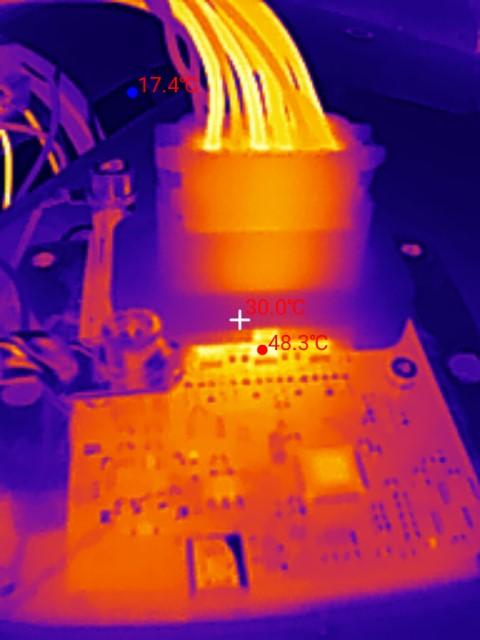
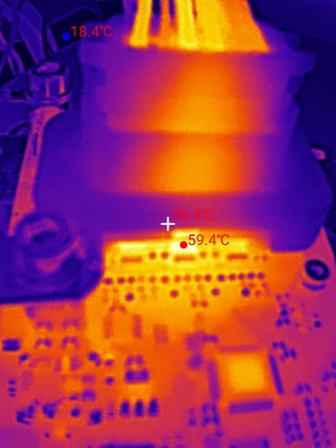
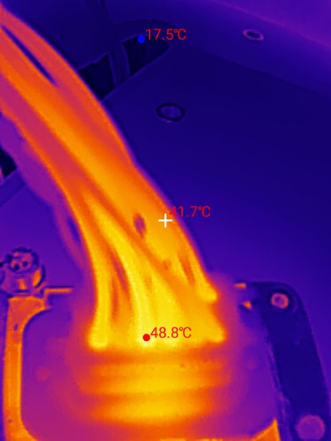
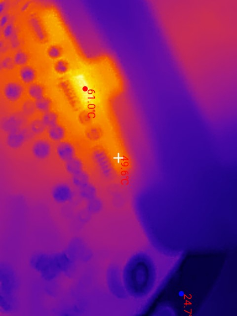

## Full Load Test

<sub>`Note: if graphs do not load, refresh the page`</sub>

```vegalite 
{
    "schema-url": "assets/charts/dingopdm_stresstest.json"
}
```

```vegalite 
{
    "schema-url": "assets/charts/dingopdm_stresstest_reduced.json"
}
```

- Full load tests were conducted with a dummy load at 71A total.
- The device was mounted horizontaly (worst case).
- Ambient temperature `19°C`
- Resistive load on all outputs
- Temperature taken with onboard temperature sensor, unless otherwise noted
- All outputs on and under load
- All outputs wired using 14AWG TXL in free air and approx. 2 feet long
- Battery power wired using 4AWG cable and copper lug
- Ground wired using 20AWG TXL
- Green
    - `100%` duty cycle
    - No case
- Orange
    - `50%` duty cycle @ `400Hz`
    - No case
- Pink
    - `100%` duty cycle
    - Case installed
- Purple
    - `100%` duty cycle
    - Case installed
    - Temperature taken at top of Profet (output 3/4) using thermocouple
- Yellow
    - Warning temperature limit `55°C`
    - Reaction: warning message sent
- Red
    - Critical temperature limit `80°C`
    - Reaction: device shutdown, power cycle required

### Notes

- Thermal performance is similar with or without PWM (on resistive loads)
- The onboard temperature sensor follows the junction temperature within a few degrees after 10 minutes
- Installing the case increases the temperature by a maximum of `5°C`
- The temperatures seen by the onboard sensor and thermocouple are much lower than the maximum temperature of the Profet junction `150°C`


## Thermal Images

These images were captured during the 100% duty cycle full load test. 

The highest temperature recorded was 61°C at the top of the output 3/4 Profet (BTS7008-2EPA). 






### Notes

- Deutsch DT connectors have an operating temperature range up to `125°C`
  - While we do not know the actual internal temperature, the highest recorded external temperature during these tests was around `50°C`
  - That is much lower than the rated operating temperature, which suggests higher current may be possible


## Thermal Resistance

Before building or testing any hardware, we can calculate the expected temperature on the top of the Profet. 

To do this, we need these values:

- Ambient temperature (°C)
- Total current (A)
- R<sub>thJA</sub> (K/W)
    - See Infineon datasheet section 4.4
    - Thermal Resistance Junction to Ambient, (K/W)=(C/W)
    - Temperature rise per dissipated watt from the internal junction to ambient
    - Value calculated by Infineon at natural convection on a 4 layer PCB:
        - 2oz outer copper
        - 1oz inner copper
        - 76.2mm x 114.3mm board
    - The resulting value is added to the ambient temperature
    - Infineon uses Kelvin/Watt, this is equal to Celsius/Watt
- Ψ<sub>JTOP</sub> (K/W)
    - See Infineon datasheet section 4.4
    - Thermal Characterization Parameter Junction Top, (K/W)=(C/W)
    - Thermal resistance between the internal junction and the top of chip case
    - Value calculated by Infineon using the same test parameters as R<sub>thJA</sub> above
    - The resulting value will be subtracted from the junction temperature to find the expected temperature at the top of the chip case
- R<sub>DS(ON)</sub> (mΩ)
    - See Infineon datasheet section 7.5.1
    - On State Resistance (mΩ)
    - Resistance between the battery connection and the output when the Profet is on, varies with junction temperature
    - Use this to calculate the heat generated by the chip
    - Assuming the junction temperature is 60°C, use R<sub>DS(ON)</sub> of 3.2mΩ and 11mΩ

BTS7002-1EPP

`Power(W)` = (Current x R<sub>DS(ON)</sub>) x Current = 12<sup>2</sup> x 3.2 = `0.461 W`

`Junction Temp(°C)` = Ambient + (Power x R<sub>thJA</sub>) = 19 + (0.461 x 30.7) = `33°C`

`Case Top(°C)` = Junction Temp - (Power * Ψ<sub>JTOP</sub>) = 33 - (0.461 x 3) = `32°C`

BTS7008-2EPA

`Power(W)` = (Current x R<sub>DS(ON)</sub>) x Current = 8<sup>2</sup> x 11 = `0.704 W` x 2 = `1.408 W`

`Junction Temp(°C)` = Ambient + (Power x R<sub>thJA</sub>) = 19 + (1.408 x 30.9) = `63°C`

`Case Top(°C)` = Junction Temp - (Power * Ψ<sub>JTOP</sub>) = 63 - (1.408 x 1.7) = `60°C`

| Model        | R<sub>DS(ON)</sub> @ 25°C (mΩ) | R<sub>DS(ON)</sub> @ 150°C (mΩ) | R<sub>DS(ON)</sub> (mΩ) | Current Per Output (A) | Dissipated Power (W) | # Channels | Total Dissipated Power (W) | Ambient Temp (°C) | R<sub>thJA</sub> (C/W) | Junction Temp (°C) | Ψ<sub>JTOP</sub> (C/W) | Case Top (°C) |
|:------------:|:------------------------------:|:-------------------------------:|:-----------------------:|:----------------------:|:--------------------:|:----------:|:--------------------------:|:-----------------:|:----------------------:|:------------------:|:----------------------:|:-------------:|
| BTS7002-1EPP | 2.6                            | 4.8                             | 3.2                     | 12                     | 0.461                | 1          | 0.461                      | 19                | 30.7                   | 33                 | 3                      | 32            |
| BTS7008-2EPA | 9                              | 16                              | 11                      | 8                      | 0.704                | 2          | 1.408                      | 19                | 30.9                   | 63                 | 1.7                    | 60            |

### Notes

- The BTS7008-2EPA expected case temperature (`60°C`) is close to the measured values
    - Thermocouple = `55°C` 
        - May be reduced due to glue used to hold thermocouple
    - Thermal camera = `61°C`
- The BTS7002-1EPP expected case temperature (`32°C`) is lower than the measured value
    - Thermal camera = `50°C`
    - This may be caused by the adjacent BTS7008-2EPA which is at a higher temperature of `60°C`
- The Profet maximum junction temperature is `150°C`, much higher than the temperatures we are seeing in these full load tests